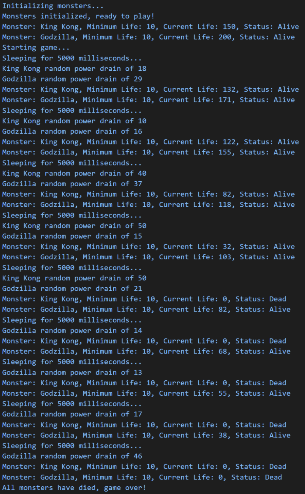

## File Overview:

- p5.js: Entry point for the game, createes instances of the monsters with their initial values. The game ends when all monsters have died.
- p5-monster-game.js: The code module for the MonsterGame class and has methods to create a. monster array and plays the game.

  
_-Example output of the Monster Game_

- p5-monster.js: Contains the Monster Class. Uses a constructor for the name, current life, and minimum life of a monster. It will also randomly drain life from the current life until it reaches the minimum life.
